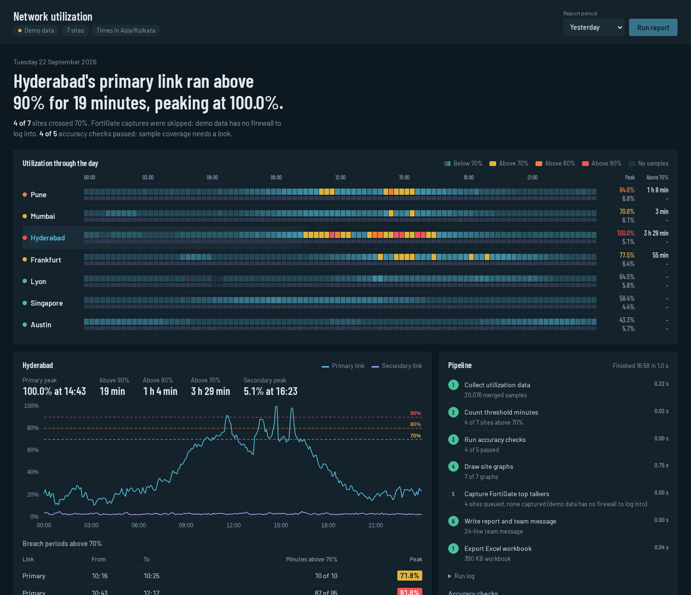
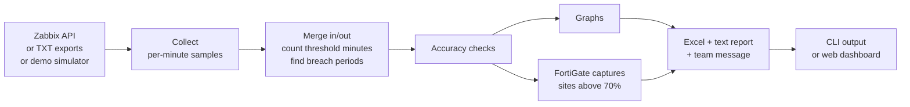

# Network Utilization Automation

Daily WAN link utilization reporting for multi-site networks. It pulls per-minute link data from **Zabbix**, counts how long each site's primary and secondary links ran above 70/80/90%, validates the numbers, draws graphs, captures FortiGate top talkers for congested sites, and delivers an Excel report and a ready-to-send team message. A web dashboard shows the whole run.

I built the first version at work to replace a manual morning routine across 7 enterprise sites: open Zabbix, check every link, screenshot graphs, log into firewalls, fill in Excel, write the update. Automating it cut the manual reporting effort by about 80%. This repository is a rebuilt public version with a demo data source, so anyone can run it without access to a real network.

**[Live demo](https://shubh1402.github.io/Network-utilization-automation/)** (static snapshot of one run) · [How it works](#how-it-works) · [Quick start](#quick-start) · [Connect to Zabbix](#connect-to-a-real-zabbix)



## What you get from one run

| Output | What's in it |
|---|---|
| Excel workbook | Summary per site and link (peak, time of peak, average, P95, minutes above 90/80/70%), breach periods, an hour-by-hour heatmap, graphs for every site, accuracy check results |
| Team message | A short update for Teams, email or WhatsApp, leading with the most important finding |
| Text report | The full numbers in plain text for the archive |
| Dashboard | Day strip of every link, per-site chart, breach periods, live pipeline progress, run history, downloads |

## How it works



The CLI and the web API run the same `PipelineRun` class, so the dashboard shows exactly what the scheduled job produces.

### Counting rules

These match the rules used in production:

- **One value per minute per link.** Inbound and outbound are merged by taking the higher of the two, because a link is congested if either direction is saturated.
- **Strictly above.** A minute at exactly 70.0% does not count as above 70%.
- **Cumulative counts.** A minute at 93% counts towards above 90, above 80 and above 70.
- **Breach periods.** Minutes above 70% separated by a dip of 5 minutes or less are reported as one period, so one busy afternoon isn't listed as twelve separate events. Each period records how many minutes were actually above 70%, so the periods always add up to the headline count.
- **FortiGate trigger.** Any site with a link above 70% gets a top-talker capture, because the next question after "was it congested?" is always "who was using it?".

### Accuracy checks

A report that goes to a team every morning has to be right, so every run checks itself before anything is written:

| Check | Catches |
|---|---|
| All sites reporting | A site whose Zabbix host or items returned nothing |
| Threshold counts consistent | Counts that don't nest (above 90 must be ≤ above 80 ≤ above 70 ≤ total) |
| Values within 0-100% | Bad unit conversions or corrupted samples |
| Sample coverage | Collection gaps (a 40-minute agent outage can hide a breach) |
| Breach periods reconcile | Period detection losing or double-counting minutes |
| TXT mode: files mapped, data present, lines parsed, report matches raw files | Misnamed exports, empty files, format changes |

`compare.py` goes one step further: it reconciles a raw TXT export against the API for the same site and day, count by count.

## Quick start

Requires Python 3.10+.

```bash
git clone https://github.com/shubh1402/Network-utilization-automation.git
cd Network-utilization-automation
python -m venv .venv && source .venv/bin/activate      # Windows: .venv\Scripts\activate
pip install -r requirements.txt
cp .env.example .env                                   # DATA_SOURCE=demo works out of the box
```

**Dashboard**

```bash
uvicorn src.api.app:app --reload
```

Open http://127.0.0.1:8000 and press **Run report**.

**Command line**

```bash
python -m src.main                                          # asks for the period
python -m src.main --mode yesterday                         # for schedulers
python -m src.main --mode date --date 22-09-2026
python -m src.main --mode range --from 16-09-2026 --to 22-09-2026
```

Outputs go to `output/runs/<run id>/`.

**Docker**

```bash
docker build -t net-util . && docker run -p 8000:8000 --env-file .env net-util
```

### The demo data

`DATA_SOURCE=demo` generates realistic per-minute traffic for 7 sites in 4 timezones: office-hours curves in each site's local time, lunch dips, quiet weekends, nightly backup windows, short bursts, a primary-link failover that pushes traffic onto the smaller backup link, and occasional collection gaps. It's seeded by site and date, so the same day always gives the same numbers. The data flows through the same merge and summary code as real Zabbix data.

## Connect to a real Zabbix

1. **Create an API token** in Zabbix (User settings → API tokens) for a user with read access to the site hosts.
2. **Describe your sites** in `config/sites.local.json` (same format as `config/sites.json`; it's git-ignored so your real site names stay private) and set `SITES_FILE=config/sites.local.json`.
3. **Fill in `.env`**: `DATA_SOURCE=zabbix`, `ZABBIX_API_URL`, `ZABBIX_API_TOKEN`.
4. **Check the item names.** Each site host needs four items; the defaults are `Primary link utilization inbound` / `outbound` and the same for `Secondary`. Override them with `ZABBIX_ITEM_*` in `.env`. If your items report bits per second instead of %, set `capacity_mbps` for each link in the sites file and the values are converted.
5. Run `python -m src.main --mode yesterday`. If a host or item is missing, the run log names it and the "All sites reporting" check fails for that site.

Zabbix 6.4+ uses Bearer-token auth (default). For older versions set `ZABBIX_AUTH_MODE=body`.

**Optional extras**

- `GRAPH_MODE=zabbix` screenshots each link's graph from the Zabbix web UI with Selenium instead of drawing it (add `zabbix_graph_ids` per site).
- FortiGate captures need `FORTIGATE_<KEY>_URL/USERNAME/PASSWORD` per site. Login field ids and the FortiView path vary between FortiOS versions, so they're configurable in `.env`; check them once against your firewall.

**No API access?** Export each link's history from Zabbix (Latest data → History → As plain text), drop the files into `input/logs/` named like `Pune_Primary.txt`, and use `DATA_SOURCE=txt`. To try it with generated files: `python scripts/make_sample_logs.py --date 22-09-2026`.

**Scheduling.** Run `python -m src.main --mode yesterday` every morning with cron (`0 7 * * *`) or Windows Task Scheduler.

## API

| Method | Path | Purpose |
|---|---|---|
| GET | `/api/health` | Status and active data source |
| GET | `/api/config` | Sites, thresholds, timezone |
| POST | `/api/runs` | Start a run: `{"mode": "yesterday" \| "today" \| "date" \| "range", "date", "from_date", "to_date", "source"}` |
| GET | `/api/runs` | Recent runs |
| GET | `/api/runs/{id}` | Full run: stages, logs, results, checks |
| GET | `/api/runs/latest` | Latest successful run |
| GET | `/api/runs/{id}/files/{excel\|report\|message}` | Download an output |

Interactive docs at `/docs`. One run at a time; a second request while one is running gets `409`.

## Project layout

```
config/sites.json             site inventory (demo sites; real list goes in sites.local.json)
src/
  main.py                     CLI
  compare.py                  TXT export vs API reconciliation
  config.py                   .env + site inventory
  api/app.py                  FastAPI app, serves the dashboard
  clients/zabbix_client.py    JSON-RPC client: token auth, retries, chunked history
  sources/                    zabbix_source, txt_source, demo_source
  services/
    utilization_service.py    merge, threshold counts, breach periods, headline
    pipeline.py               the 7-stage run used by CLI and API
    run_store.py              run history for the API
  validation/                 accuracy checks
  capture/                    graph renderer, Zabbix + FortiGate Selenium capture
  excel/report_generator.py   workbook
  messages/                   text report and team message
web/                          dashboard (plain HTML/CSS/JS + Chart.js, no build step)
scripts/                      sample TXT exports, static demo builder
tests/                        pytest suite
docs/index.html               static live demo (GitHub Pages)
```

## Tests

```bash
pip install -r requirements-dev.txt
pytest -q
```

The suite covers the counting rules, breach-period merging, the TXT parser (including a round trip: export demo data in Zabbix's text format, parse it back, get identical numbers), the Zabbix client and source against a fake API (auth modes, errors, bps conversion), the accuracy checks, the full pipeline and every API endpoint. GitHub Actions runs lint and tests on every push.

## Design decisions

- **Graphs are drawn from the data by default** rather than screenshotted. It needs no browser or web login, it's faster, and the graph can never disagree with the numbers next to it. Screenshots remain available for teams that want the familiar Zabbix look.
- **A missing site is reported, not skipped.** If Zabbix returns nothing for a site, the report says "no data" for it instead of quietly leaving it out, because silence is itself an incident.
- **No frontend build step.** The dashboard is plain JavaScript with a vendored Chart.js and fonts, so it works on locked-down networks without internet access.
- **One pipeline, two front doors.** The scheduled CLI and the dashboard share the same code path, so there's nothing to keep in sync.

## Stack

Python · Zabbix JSON-RPC API · FastAPI · NumPy · Matplotlib · OpenPyXL · Selenium · Chart.js · pytest · GitHub Actions · Docker
